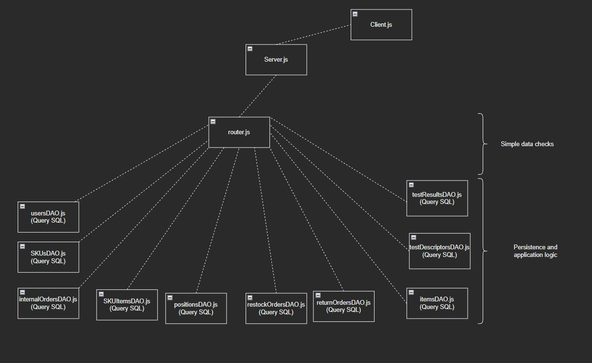

# Integration and API Test Report

Date: 25/05/2022

Version: 1.0

# Contents

- [Dependency graph](#dependency_graph)

- [Integration approach](#integration)

- [Tests](#tests)

- [Scenarios](#scenarios)

- [Coverage of scenarios and FR](#scenario-coverage)
- [Coverage of non-functional requirements](#nfr-coverage)

# Dependency graph 

     
# Integration approach
    
    We adopted a Bottom-Up integration sequence approach following the next steps:

     Step 1: Test functions in all DAO.js files in "modules" folder
     Step 2: Test APIs in router.js in "router" folder

#  Integration Tests

## Step 1
| Classes  | mock up used |Jest test cases |
|--|--|--|
|itemsDAO.js|/|items.test.js|
|usersDAO.js|/|users.test.js|
|internalOrdersDAO.js|/|internalOrders.test.js|
|positionsDAO.js|/|positions.test.js|
|restockOrdersDAO.js|/|restockOrders.test.js|
|returnOrdersDAO.js|/|returnOrders.test.js|
|SKUsDAO.js|/|SKU.test.js|
|testDescriptorsDAO.js|/|testDescriptors.test.js|
|testResultsDAO.js|/|testResults.test.js|
|SKUItemsDAO.js|/|SKUItems.test.js|

# Coverage of Scenarios and FR

| Scenario ID | Functional Requirements covered | Mocha  Test(s) | 
| ----------- | ------------------------------- | -------------------------| 
| 4-1         | FR 1.1                          |newUser    (testUsers.js) |             
| 4-2         | FR 1.1                          |updateUser (testUsers.js) |             
| 4-3         | FR 1.3                          |deleteUser (testUsers.js) |           
| 1-1         | FR 2.1                          |newSKU     (testSKURouter.js)              |
| 1-2         | FR 2.1                          |updateSkuPosition    (testSKURouter.js)     |
| 1-3         | FR 2.1                          |update    (testSKURouter.js)     |             
| 2-1         | FR 3.1.1                        |testcreate   (testPosition.js)             | 
| 2-2         | FR 3.1.1                        |testmodifypositionID   (testPosition.js)    |
| 2-3         | FR 3.1.1                        |testupdatePosition    (testPosition.js)     | 
| 2-5         | FR 3.1.2                        |testdeletePosition    (testPosition.js)     | 
| 6-1         | FR 5.9                          |newRet     (testReturnOrder.js)               |

# Coverage of Non Functional Requirements

### 

| Non Functional Requirement | Test name |
| -------------------------- | --------- |
|                            |           |

