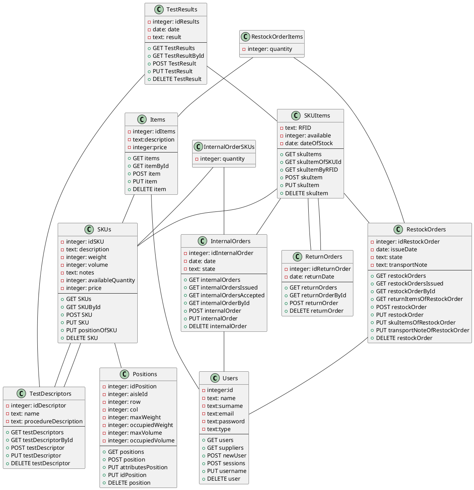

# Design Document 


Authors: Lorenzo Buompane, Simone Romantini, Jonathan Damone, Roberto Di Ciaula

Date: 21/06/2022 

Version: 3.0


# Contents

- [Design Document](#design-document)
- [Contents](#contents)
- [High level design](#high-level-design)
- [Low level design](#low-level-design)
- [Verification traceability matrix](#verification-traceability-matrix)
- [Verification sequence diagrams](#verification-sequence-diagrams)
  - [scenario 1-1](#scenario-1-1)
  - [scenario 3-1](#scenario-3-1)
  - [scenario 5-1-1](#scenario-5-1-1)
  - [Scenario 9-1](#scenario-9-1)


# High level design 


EZWH is a layered application that consists of one executable generating one process and thread for each user.
The application is composed of the following packages:
- Data : for data processing and managing
- GUI : to implement the Graphical User Interface
- Exceptions : to handle exceptions triggered by users' actions

We use a MVC pattern because the users of EZWH application can modify data and the views must change. Additionally,
EZWH follows the 3-tier pattern because it manages data stored on the file system("data" tier) via use of application functions
("application tier") and a GUI("presentation" tier).


# Low level design


# Verification traceability matrix

| User                                                  | Item    | RestockOrder | SKU | SKUItem | TestDescriptor | Position | InternalOrder |
|-------------------------------------------------------|---------|--------------|-----|---------|----------------|----------|---------------|
| Manage users and rights                               | FR1     | x            |     |         |                |          |               |
| Define a new user, or modify an existing user         | FR1.1   | x            |     |         |                |          |               |
| Delete a user                                         | FR1.2   | x            |     |         |                |          |               |
| List all users                                        | FR1.3   | x            |     |         |                |          |               |
| Search a user                                         | FR1.4   | x            |     |         |                |          |               |
| Manage rights.                                        | FR1.5   | x            |     |         |                |          |               |
| Manage SKU                                            | FR2     |              |     |         | x              |          |               |
| Define a new SKU, or modify an existing SKU           | FR2.1   |              |     |         | x              |          |               |
| Delete a SKU                                          | FR2.2   |              |     |         | x              |          |               |
| List all SKUs                                         | FR2.3   |              |     |         | x              |          |               |
| Search a SKU (by ID, by description)                  | FR2.4   |              |     |         | x              |          |               |
| Manage Warehouse                                      | FR3     |              |     |         |                |          |               |
| Manage positions                                      | FR3.1   |              |     |         |                |          |               |
| Define a new position, or modify an existing position | FR3.1.1 |              |     |         |                |          |               |
| Delete a position                                     | FR3.1.2 |              |     |         |                |          |               |
| List all positions                                    | FR3.1.3 |              |     |         |                |          |               |
| Modify attributes of a position                       | FR3.1.4 |              |     |         |                |          |               |
| Manage quality tests                                  | FR3.2   |              |     |         |                |          | x             |
| Add a quality test                                    | FR3.2.1 |              |     |         |                |          | x             |
| Modify a quality test                                 | FR3.2.2 |              |     |         |                |          | x             |
| Delete a quality test                                 | FR3.2.3 |              |     |         |                |          | x             |
| Manage internal customers                             | FR 4    | x            |     |         |                |          |               |
| Register or modify a customer                         | FR4.1   | x            |     |         |                |          |               |
| Delete a customer                                     | FR4.2   | x            |     |         |                |          |               |
| Search a customer                                     | FR4.3   | x            |     |         |                |          |               |
| List  all customers                                   | FR4.4   | x            |     |         |                |          |               |
| Manage a restock order                                | FR5     |              |     | x       |                |          |               |
| Start a restock order                                 | FR5.1   |              |     | x       |                |          |               |
| Add a SKU to a restock order                          | FR5.2   |              |     | x       |                |          |               |
| Define quantity of SKU to be ordered                  | FR5.3   |              |     | x       |                |          |               |
| Delete a SKU from a restock order                     | FR5.4   |              |     | x       |                |          |               |
| Select a Supplier for the restock order               | FR5.5   |              |     | x       |                |          |               |
| Issue  a restock order                                | FR5.6   |              |     | x       |                |          |               |
| Change state of a restock order                       | FR5.7   |              |     | x       |                |          |               |
| Manage reception of a restock order                   | FR5.8   |              |     | x       |                |          |               |
| Create and tag a SKU item with an RFID                | FR5.8.1 |              |     |         |                | x        |               |
| Store result of a quality test on a SKU Item          | FR5.8.2 |              |     |         |                | x        |               |
| Store a SKU Item                                      | FR5.8.3 |              |     |         |                | x        |               |
| Start  a return order                                 | FR5.9   |              |     |         |                | x        |               |
| Return a SKU item listed in a restock order           | FR5.10  |              |     |         |                | x        |               |
| Commit a return order                                 | FR5.11  |              |     |         |                | x        |               |
| Change state of a return order                        | FR5.12  |              |     |         |                | x        |               |
| Manage internal orders                                | FR6     |              |     |         |                |          |               |
| Start an internal order                               | FR6.1   |              |     |         |                |          |               |
| Add a SKU to an internal order                        | FR6.2   |              |     |         | x              |          |               |
| Define quantity of SKU to be ordered                  | FR6.3   |              |     |         | x              |          |               |
| Delete a SKU from an internal order                   | FR6.4   |              |     |         | x              |          |               |
| Issue an internal order                               | FR6.5   |              |     |         |                |          |               |
| Accept, reject or cancel an internal order            | FR6.6   |              |     |         |                |          |               |
| Change state of an internal order                     | FR6.7   |              |     |         |                |          |               |
| Manage delivery of an internal order                  | FR6.8   |              |     |         |                |          |               |
| Select SKU Item with a FIFO criterion                 | FR6.9   |              |     |         | x              |          |               |
| Remove SKU Item from warehouse                        | FR6.10  |              |     |         | x              |          |               |
| Manage Items                                          | FR7     |              | x   |         |                |          |               |


# Verification sequence diagrams 

## scenario 1-1 
```plantuml
Manager -> SKU: SKU:post(id,weight,volume,SKU notes,
SKU ->Manager  : response(ok)
```


## scenario 3-1 
```plantuml
Manager ->R0: new SKU description 
Manager -> R0: fills quantity of item to be ordered
Manager -> R0: select supplier SP that can sastisfy order
Manager -> R0: confirms inserted data  
Manager -> R0: new SKU notes
R0 -> database: recorded in the system in ISSUED state

```

## scenario 5-1-1
```plantuml
R0 -> Clerk: arrives to the shop 
Clerk -> Database : records e the system with a new RFID
Database -> SKU_ITEM  : stores RFID and changed the state
```
## Scenario 9-1 
```plantuml

User -> internal_order: new Internal Order 
User -> SKU: adds every SKU he wants
internal_order ->User: ask confermation
User -> internal_order: confermation
internal_order ->User:  System issue IO with status
internal_order ->manager:  checks IO and accepts it
manager -> User: confermation
```
