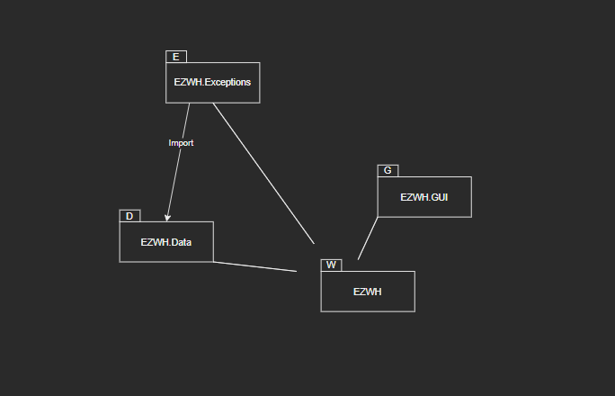

# Design Document 


Authors: Lorenzo Buompane, Simone Romantini, Jonathan Damone, Roberto Di Ciaula

Date: 21/06/2022 

Version: 3.0


# Contents

- [Design Document](#design-document)
- [Contents](#contents)
- [High level design](#high-level-design)
- [Low level design](#low-level-design)
- [Verification traceability matrix](#verification-traceability-matrix)
- [Verification sequence diagrams](#verification-sequence-diagrams)
  - [scenario 1-1](#scenario-1-1)
  - [scenario 3-1](#scenario-3-1)
  - [scenario 5-1-1](#scenario-5-1-1)
  - [Scenario 9-1](#scenario-9-1)


# High level design 


EZWH is a layered application that consists of one executable generating one process and thread for each user.
The application is composed of the following packages:
- Data : for data processing and managing
- GUI : to implement the Graphical User Interface
- Exceptions : to handle exceptions triggered by users' actions

We use a MVC pattern because the users of EZWH application can modify data and the views must change. Additionally,
EZWH follows the 3-tier pattern because it manages data stored on the file system("data" tier) via use of application functions
("application tier") and a GUI("presentation" tier).


# Low level design


# Verification traceability matrix

|          | Users(Customers,Manager,Suppliers) | TestResults | TestDescriptor | SKU | SKUItem | ReturnOrders | RestockOrders | Positions | Items | InternalOrders | Data Layer |
|----------|-------|-------------|----------------|-----|---------|--------------|---------------|-----------|-------|----------------|------------|
|  FR1     |   x   |             |                |     |         |              |               |           |       |                |      x     |
|  FR2     |   x   |             |                |     |         |              |               |           |       |                |      x     |
|  FR3     |       |      x      |        x       |  x  |         |              |               |     x     |       |                |      x     |
|  FR4     |   x   |             |                |     |         |              |       x       |           |       |                |      x     |
|  FR5     |   x   |             |                |  x  |    x    |      x       |       x       |           |   x   |                |      x     |
|  FR6     |   x   |             |                |  x  |    x    |              |               |           |       |        x       |      x     |
|  FR7     |   x   |             |                |  x  |         |              |               |           |   x   |                |      x     |


# Verification sequence diagrams 


## scenario 1-1 
```plantuml
Manager -> SKU: createSKU(description, weight, volume, notes, availableQuantity, price)
SKU->Manager: responsestatus(201 created)
SKU->Data Layer: recorded in the system 

```

## scenario 3-2 
```plantuml
Manager -> Users: getSuppliers
Users -> Manager: response(Suppliers array), response.status(200 ok)
Manager -> R0: insertROI(idRestockOrder, idItem, qty)
Manager -> R0: insertRO(issueDate, supplierId)
R0 -> Manager: response.status(201 created)
Manager -> R0: putSkuItemsOfRestockOrder(id, rfid, SKUId)
Manager -> R0: putTNRestockOrder(id, TransportNote)
Manager -> R0: putStateRestockOrder(id, newState = ISSUED)
R0 -> Manager: response.status(200 ok)
R0 -> DataLayer: recorded in the DB

```

## scenario 5-1-1
```plantuml
R0 -> Clerk: arrives to the shop 
Clerk -> SKU: findSKU(idSKU)
SKU -> Clerk: response(SKU), response.status(200 ok)
Clerk -> SKUItems: createSKUItem(rfid, SKUId, date)
SKUItems -> Clerk: response.status(201 created)
Clerk -> Items: creataeItem(description, id, SKUId, supplierId, price)
Items -> Clerk:  response.status(201 created)
SKUItems -> DataLayer : recorded in the DB
Items -> DataLayer  : recorded in the DB
```
## Scenario 9-1 
```plantuml

Clerk -> InternalOrders: insertIO(issueDate, customerId)
InternalOrders -> Clerk: response.status(201 created)
Clerk -> SKU: findSKU(idSKU)
SKU -> Clerk: response(SKU), response.status(200 ok)
Clerk -> InternalOrders: insertIOS(id,SKUId, qty)
InternalOrders ->Clerk: response.status(200 ok)
InternalOrders -> DataLayer: recorded in the DB
DataLayer -> InternalOrders: updateIntOrder(id, ISSUED)
DataLayer -> SKU: updateSKU(position,quantity)
Manager -> DataLayer: Check & Accepted
DataLayer -> InternalOrders: updateIntOrder(id, ACCEPTED)


```
