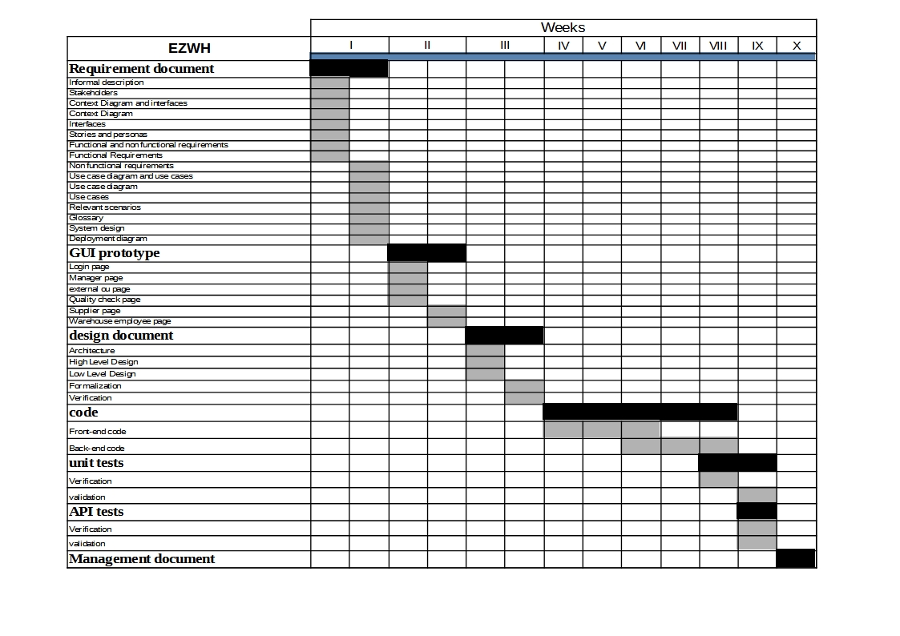

# Project Estimation  

Authors: Lorenzo Buompane, Simone Romantini, Jonathan Damone, Roberto Di Ciaula

Date: 11 april 2022

Version: 2.0

# Estimation approach
Consider the EZWH  project as described in YOUR requirement document, assume that you are going to develop the project INDEPENDENT of the deadlines of the course

# Estimate by size
### 
|             | Estimate                        |             
| ----------- | ------------------------------- |  
| NC =  Estimated number of classes to be developed   |            40                |             
|  A = Estimated average size per class, in LOC       |          50                  | 
| S = Estimated size of project, in LOC (= NC * A) | 2000 |
| E = Estimated effort, in person hours (here use productivity 10 LOC per person hour)  |                200                      |   
| C = Estimated cost, in euro (here use 1 person hour cost = 30 euro) | 6000 | 
| Estimated calendar time, in calendar weeks (Assume team of 4 people, 8 hours per day, 5 days per week ) |       10           |               

# Estimate by product decomposition
### 
|         Component name    | Estimated effort (person hours)   |             
| ----------- | ------------------------------- | 
|requirement document    | 24 |
| GUI prototype |30|
|design document |40|
|code |200|
| unit tests |58|
| api tests |24|
| management documents  |24|

# Estimate by activity decomposition
### 
|         Activity name    | Estimated effort (person hours)   |             
| ----------- | ------------------------------- |
|**Requirement document**| **24** |
| 	Informal description	| 	0.5	| 
| 	Stakeholders	| 	0.5	| 
| 	Context Diagram and interfaces	| 	0.5	| 
| 	Context Diagram	| 	1	| 
| 	Interfaces	| 	1	| 
| 	Stories and personas	| 	1.5	| 
| 	Functional Requirements	| 	3	| 
| 	Non functional requirements	| 	3	| 
| 	Use case diagram	| 	4	| 
| 	Use cases 	| 	4	| 
| 	Relevant scenarios	| 	2	| 
| 	Glossary	| 	1	| 
| 	System design	| 	2	| 
| 	Deployment diagram	| 	2,5	| 
| 	**GUI prototype**	| 	**30**	| 
| 	Login page	| 	2	| 
| 	Manager page	| 	8	| 
| 	external ou page	| 	5	| 
| 	Quality check page	| 	5	| 
| 	Supplier page	| 	5	| 
| 	Warehouse employee page	| 	5	| 
| 	**design document**	| 	**40**	| 
| 	Architecture	| 	5	| 
| 	High Level Design	| 	5	| 
| 	Low Level Design	| 	20	| 
| 	Formalization	| 	5	| 
| 	Verification	| 	5	| 
| 	**code**	| 	**200**	| 
| 	Front-end code	| 	50	| 
| 	Back-end code	| 	150	| 
| 	**unit tests**	| 	**58**	| 
| 	Verification	| 	29	| 
| 	validation	| 	29	| 
| 	**API tests**	| 	**24**	| 
| 	Verification	| 	12	| 
| 	validation	| 	12	| 
| 	**Management document** 	| 	**24**	| 

###

# Summary

|             | Estimated effort (person hours)                      |   Estimated duration (Days)|          
| ----------- | ------------------------------- | ---------------|
| estimate by size |200|25|
| estimate by product decomposition |400|50|
| estimate by activity decomposition |400| 50|

