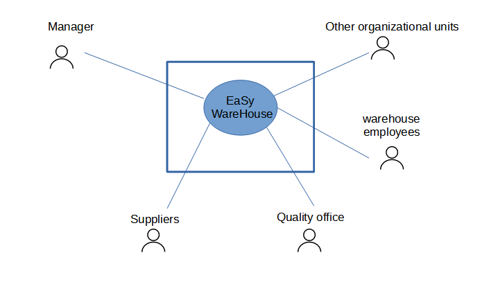
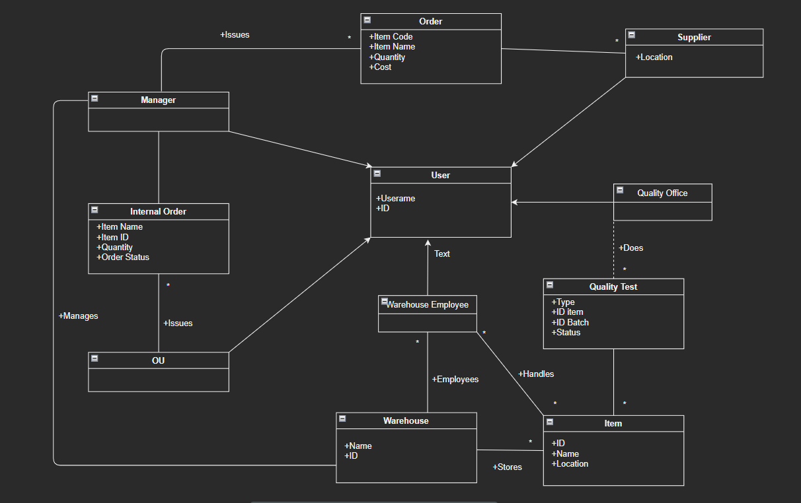

# Requirements Document 

Authors: Lorenzo Buompane, Simone Romantini, Jonathan Damone, Roberto Di Ciaula

Date: 11 april 2022

Version: 5.0

 
| Version number | Change |
| ----------------- |:-----------|
| 1.0 | Add Stackholders, Context Diagram and interfaces | 
| 2.0 | Add Stories and F/NF requirements|
|3.0|Add Use Case diagram and use cases|
|3.1|Add relevant scenarios|
|4.0|Add Glossary, System and Deployment diagram|
|5.0|Final review|

# Contents

- [Informal description](#informal-description)
- [Stakeholders](#stakeholders)
- [Context Diagram and interfaces](#context-diagram-and-interfaces)
	+ [Context Diagram](#context-diagram)
	+ [Interfaces](#interfaces) 
	
- [Stories and personas](#stories-and-personas)
- [Functional and non functional requirements](#functional-and-non-functional-requirements)
	+ [Functional Requirements](#functional-requirements)
	+ [Non functional requirements](#non-functional-requirements)
- [Use case diagram and use cases](#use-case-diagram-and-use-cases)
	+ [Use case diagram](#use-case-diagram)
	+ [Use cases](#use-cases)
    	+ [Relevant scenarios](#relevant-scenarios)
- [Glossary](#glossary)
- [System design](#system-design)
- [Deployment diagram](#deployment-diagram)

# Informal description
Medium companies and retailers need a simple application to manage the relationship with suppliers and the inventory of physical items stocked in a physical warehouse. 
The warehouse is supervised by a manager, who supervises the availability of items. When a certain item is in short supply, the manager issues an order to a supplier. In general the same item can be purchased by many suppliers. The warehouse keeps a list of possible suppliers per item. 

After some time the items ordered to a supplier are received. The items must be quality checked and stored in specific positions in the warehouse. The quality check is performed by specific roles (quality office), who apply specific tests for item (different items are tested differently). Possibly the tests are not made at all, or made randomly on some of the items received. If an item does not pass a quality test it may be rejected and sent back to the supplier. 

Storage of items in the warehouse must take into account the availability of physical space in the warehouse. Further the position of items must be traced to guide later recollection of them.

The warehouse is part of a company. Other organizational units (OU) of the company may ask for items in the warehouse. This is implemented via internal orders, received by the warehouse. Upon reception of an internal order the warehouse must collect the requested item(s), prepare them and deliver them to a pick up area. When the item is collected by the other OU the internal order is completed. 

EZWH (EaSy WareHouse) is a software application to support the management of a warehouse.

# Stakeholders

| Stakeholder name  | Description | 
| ----------------- |:-----------:|
|   Warehouse's Manager     |    Uses the application to manage items and orders         | 
|   Other Organizational units      |      Use the application to issue internal orders       | 
|   Quality Office    |      Uses the application to, in case of failed tests, rejects items       | 
| Warehouse employees | Use the application to check if there are and if so how many  items to allocate in the warehouse
|   Suppliers     |    Uses the application to get orders from managers         |

# Context Diagram and interfaces

## Context Diagram

## Interfaces

| Actor | Logical Interface | Physical Interface  |
| ------------- |:-------------:| -----:|
|   Warehouse's Manager     | GUI | Screen, keyboard,mouse |
|   Other Organizational units     | GUI | Screen, keyboard,mouse |
|   Warehouse employees     | GUI | PDA |
| Quality office| GUI | Screen, keyboard, mouse |
|   Suppliers    | GUI | Screen, keyboard,mouse |

# Stories and personas

## Quality Office
Jack is part of the company NotAmazon's Quality Office and needs a way to communicate and coordinate with the warehouse's manager to handle quality tests on the items.Thanks to EZWH he will be able to easily keep track on what items he has to test, what test and their results!

## Warehouse employees
Gianfranco is a skilled worker who works in the warehouse from 5 a.m. until 8 p.m. This man needs a parcel tracking system that does not make him too busy.
If he receives a call with a serial number and location, he takes the order, picks up the resource and delivers it to the pick-up point.
when he gets an order for new items to be placed, he thanks the Lord that EZWH exists and tells him where to put the stuff without going crazy. 

## Suppliers
Frank provides to companies bolts producted in his own company, as frontman of BulloniEnterprise
Frank is actually a suppliers
Frank usually sends and receive emails from companies to talk about their actual stock of bolts, and when is needed a furniture of them. Usually he talks to managers to agree on quantity and price, and then to Organizational Units when an order is requested.

## Manager
Bill, EaSy WareHouse manager, notes that there are short quantity of pencil in the warehouse and he decides to make an order (after a control of free space available) founding the best supplier on the suppliers' list for pencils. When the pencils' stock arrives in warehouse he decides the location for the stock. In the end he sends a notification to warehouse employees.

## Organizational Units
Samantha, employee of an organizational units, has not a new stack of paper to print. She makes an internal order. When she receives the notification of order ready, she reads the pick up location and goes to collect the item. 

# Functional and non functional requirements

## Functional Requirements

| ID        | Description  |
| ------------- |:-------------:| 
|FR1| Record an item and its attributes that has to be stored in what part of the warehouse |
|FR2| Delete an item entry|
|FR3| Add supplier to the list of suppliers for an item|
|FR4| Remove supplier from the list of suppliers for an item|
|FR5| Update suppliers' list of an item|
|FR6| Show how much space is available and where in the warehouse
|FR7| Indicate which item will be subject to which quality test |
|FR8| Indicate that an item failed the quality test and that it has to be sent back  |
|FR9| Issue an internal order of a certain quantity of a certain item|
|FR10| Cancel an internal order|
|FR11| Update the item's attributes|
|FR12| Receipt and notification of delivery to collection point |
|FR13| Access and manage items lists|
|FR14| Lists filtering|
|FR15| Notification of internal order|
|FR16| Log into account|
|FR17| Log out from account|
|FR18| Account registration|
|FR19| Requesting items from a supplier|
|FR20| Cancel an order made to a supplier|
## Non Functional Requirements

| ID        | Type (efficiency, reliability, ..)           | Description  | Refers to |
| ------------- |:-------------:| :-----:| -----:|
|  NFR1     | Usability  | Application should be used by anyone inside the company without training | All FR |
|  NFR2     |Performance | All functions should complete in < 0.5 sec |All FR |
|  NFR3     | Localisation |Decimal numbers use (dot) as decimal separator |All FR |
| NFR4 |Performance |Application must run on any Windows system |All FR | 

# Use case diagram and use cases

## Use case diagram

### Use case 1, UC1 - FR1 Record that an item has to be stored in what part of the warehouse
| Actors Involved        | Manager |
| ------------- |:-------------:| 
|  Precondition     | Items are available to be stored |
|  Post condition     | The items are to be stored in a determined location inside the warehouse |
|  Nominal Scenario     | Manager selects item, quantity and warehouse's location |
|  Exceptions     | There's not enough space in the warehouse |

### Use case 2, UC2 - FR2 Delete an item record
| Actors Involved        | Manager |
| ------------- |:-------------:| 
|  Precondition     | Record of selected item exists |
|  Post condition     | Record of selected item doesn't exist |
|  Nominal Scenario     | Manager selects item and deletesthe related information |
|  Exceptions     | the resource information has been deleted |

### Use case 3, UC3 - FR3 Add supplier to the list of suppliers for an item
| Actors Involved        | Manager |
| ------------- |:-------------:| 
|  Precondition     | The supplier isn't present in the suppliers list of the item  |
|  Post condition     | The supplier is present in the suppliers list of the item |
|  Nominal Scenario     | Manager selects an item, adds supplier to its list |
|  Exceptions     | the supplier is not available |

### Use case 4, UC4 - FR4 Remove supplier from the list of suppliers for an item
| Actors Involved        | Manager |
| ------------- |:-------------:| 
|  Precondition     |  The supplier is present in the suppliers list of the item |
|  Post condition     |  The supplier isn't present in the suppliers list of the item  |
|  Nominal Scenario     | Manager selects an item, removes supplier to its list |

### Use case 5, UC5 - FR5 Update suppliers' list of an item
| Actors Involved        | Manager |
| ------------- |:-------------:| 
|  Precondition     |  The supplier is present in the suppliers list of the item |
|  Post condition     |  The supplier changed name or there are modification on supplier's list of the item |
|  Nominal Scenario     | Manager updates the supplier's field of a list of an item or the supplier's list |

### Use case 6, UC6 - FR6 Show how much space is available and where in the warehouse
| Actors Involved        | Manager |
| ------------- |:-------------:| 
|  Precondition     | need to know free space |
|  Post condition     | / |
|  Nominal Scenario     | manager knows total space of warehouse and location name, application return free space querying items list and calculate (total space)-(used space)  |
| Variants | There is no more space avaible in the warehouse |

### Use case 7, UC7 - FR7 Option to indicate which item will be subject to which quality test
| Actors Involved        | Quality Office |
| ------------- |:-------------:| 
|  Precondition     | item exsist |
|  Post condition     | selected quality test |
|  Nominal Scenario     | quality office choose a test for selected item |
| Exception | Item has already been tested |

### Use case 8, UC8 - FR8 Option to indicate that an item failed the quality test and that it has to be sent back
| Actors Involved        | Quality Office |
| ------------- |:-------------:| 
|  Precondition     | Item was selected to be quality tested |
|  Post condition     | The item failed the quality test |
|  Nominal Scenario     | Quality test team selects item, selects quality test, marks the item as to be sent back |

### Use case 9, UC9 - FR9 Issue an internal order of a certain quantity of a certain item
| Actors Involved        | OU |
| ------------- |:-------------:| 
|  Precondition     | The OU needs a certain item |
|  Post condition     | The internal order is issued to the warehouse |
|  Nominal Scenario     | The OU makes an internal order and an internal order is now pending |
| Exceptions    | Warehouse has not enough items to satisfy the order |

### Use case 10, UC10 - FR10 Cancel an internal order
| Actors Involved        | Manager, OU |
| ------------- |:-------------:| 
|  Precondition     | The item is not present in the warehouse, the item is not needed anymore |
|  Post condition     | The internal order is cancelled |
|  Nominal Scenario     | The manager checks if the item is available and if not cancels the internal order, the OU cancels the internal order |

### Use case 11, UC11 - FR11 Update the item's attributes
| Actors Involved        | Manager |
| ------------- |:-------------:| 
|  Precondition     | The item's attributes have to be updated |
|  Post condition     | The item's attributes are updated |
|  Nominal Scenario     | The manager updates the item's attibutes |
|  Variants     | Only one, some or all of the attributes are updated |
### Use case 12, UC12 - FR12 Receipt and notification of delivery to collection point
| Actors Involved        | Manager, OU |
| ------------- |:-------------:| 
|  Precondition     | An order is processing  |
|  Post condition     | Delivery arrived to collection point |
|  Nominal Scenario     | A notification and a receipt is sent when the delivery arrives to collection point |
|  Variants     | The order is lost and a notification is sent |

### Use case 13, UC13 - FR13 Access and manage items lists
| Actors Involved        | Manager |
| ------------- |:-------------:| 
|  Precondition     | Items List must exsist |
|  Post condition     | Changes on the content of the items list |
|  Nominal Scenario     | The manager can update items list adding or removing one or more entries |

### Use case 14, UC14 - FR14 Lists filtering
| Actors Involved        | Manager |
| ------------- |:-------------:| 
|  Precondition     | Items list must exsist |
|  Post condition     | Response to a query on items list |
|  Nominal Scenario     | The manager can make queries on items list or on item's attributes of the list |

### Use case 15, UC15 - FR15 Notification of internal order
| Actors Involved        | Manager,OU |
| ------------- |:-------------:| 
|  Precondition     | An order has to be created |
|  Post condition     | An order has been created |
|  Nominal Scenario     | A notification is sent whenever an internal order is created |

### Use case 16, UC16 - FR16 Log into account
| Actors Involved        | All |
| ------------- |:-------------:| 
|  Precondition     | The user is not logged into his/her account |
|  Post condition     | The user is logged into his/her account |
|  Nominal Scenario     | The user inserts his/her email and password to log into his/her account |
|  Variants		  | Show a warning that the password is about to expire |
|  Exceptions     | The user doesn't own a registered account |

### Use case 17, UC17 - FR17 Log out from account
| Actors Involved        | All |
| ------------- |:-------------:| 
|  Precondition     | The user is logged into his/her account  |
|  Post condition     | The user is not logged into his/her account anymore |
|  Nominal Scenario     | The user performs logout from the account |

### Use case 18, UC18 - FR18 Account registration
| Actors Involved        | All |
| ------------- |:-------------:| 
|  Precondition     |The user doesn't have an account|
|  Post condition     | The user has an account |
|  Nominal Scenario     | The user enters an username and a password to create his account |
|  Exceptions     | The email and/or password is already in use |

### Use case 19, UC19 - FR19 Requesting items from a supplier
| Actors Involved        | Manager, Suppliers |
| ------------- |:-------------:| 
|  Precondition     | The warehouse's Manager needs a certain item |
|  Post condition     | The  order is issued to the Supplier |
|  Nominal Scenario     | The manager makes an  order to the supplier and an order is now pending |
|  Variants     | The selected supplier doesn't have enough items, another one must be selected |
|  Exceptions     | No supplier has enough items to satisfy the order |

### Use case 20, UC20 - FR20 Cancel an order made to a supplier
| Actors Involved        | Manager, Suppliers |
| ------------- |:-------------:| 
|  Precondition     | The supplier is incapable of completing the order , the item is not needed anymore |
|  Post condition     | The order to the supplier is cancelled |
|  Nominal Scenario     | The supplier cancels the order, the manager cancels the order|

#### Scenario ID:1.1 | Correspond to UC1

|    |    |
| ------------- |:-------------:| 
| Description |the manager decides it is necessary to place an order for a certain quantity |
| Precondition | Supplier and object  must exsist in the list of an item |
| Postcondition |order sent|
| Step # | Step description |
| 1 | Manager sees that there is a shortage of a resource|
| 2 |chooses: quantity, which product and where to put it |
| 3 | performs transition |

#### Scenario ID:2.1 | Correspond to UC2

|    |    |
| ------------- |:-------------:| 
| Description |the manager realises that the resource was already in the warehouse|
| Precondition | item already ordered |
| Postcondition |order cancelled|
| Step # | Step description |
| 1 | Manager sees that there is a ecess of a resource|
| 2 |chooses the order|
| 3 | performs the elimination of that order |

#### Scenario ID:3.1 | Correspond to UC3

|    |    |
| ------------- |:-------------:| 
| Description |the manager realises that the resource was already in the warehouse|
| Precondition | item already ordered |
| Postcondition |order cancelled|
| Step # | Step description |
| 1 | Manager sees that there is a ecess of a resource|
| 2 |chooses the order|
| 3 | performs the elimination of that order |

#### Scenario ID:4.1 | Correspond to UC4

|    |    |
| ------------- |:-------------:| 
| Description |the manager realises that a old supplier no longer exist|
| Precondition | supplier present |
| Postcondition |supplier not present|
| Step # | Step description |
| 1 | Manager delete the  supplier's information whit a procedure|
| 2 |press the button for removing a old supplier|
| 3 |success |

##### Scenario ID:5.1 | Correspond to UC5
|    |    |
| ------------- |:-------------:| 
| Description | Manager updates some fields on supplier's list of an item |
| Precondition | Supplier must exsist in the list of an item |
| Postcondition | Supplier has gone up changes |
| Step # | Step description |
| 1 | Manager access the supplier's list of an item |
| 2 | Manager changes fields of a supplier like name or others or changes supplier's list of an item |
| 3 | Changes are committed |
| 4 | Updated list is avaible |

##### Scenario ID:6.1 | Correspond to UC6
|    |    |
| ------------- |:-------------:| 
| Description | Manager checks avaible space in warehouse and location name |
| Precondition | Need to know free space |
| Postcondition | Returned free space quantity |
| Step # | Step description |
| 1 | Manager queries the warehouse for free space |
| 2 | Warehouse returns the quantity the free space calculating (total space)-(used space) |
| 3 | Warehouse checks and returns the location of free space |
| 4 | An answer is reported to the manager |

##### Scenario 6.2 | Correspond to UC6
|    |    |
| ------------- |:-------------:| 
| Description | Manager checks avaible space in warehouse and location name |
| Precondition | Need to know free space |
| Postcondition | No free space |
| Step # | Step description |
| 1 | Manager queries the warehouse for free space |
| 2 | Warehouse calculates (total space)-(used space) but the result is 0|
| 3 | There's no location of free space because there's no free space |
| 4 | An answer with warning for no empty space is reported to the manager |

##### Scenario 7.1 | Correspond to UC7
|    |    |
| ------------- |:-------------:| 
| Description | Quality office choose a test for item selected |
| Precondition | An item must be tested with a selected test |
| Postcondition | Item tested and a result is given |
| Step # | Step description |
| 1 | Quality Office choose an item |
| 2 | Quality Office decides a test for an item |
| 3 | Item is taken from the warehouse and it is tested |
| 4 | The test return a result |
| 5 | Result is stored |

##### Scenario 8.1 | Correspond to UC8
|    |    |
| ------------- |:-------------:| 
| Description | Quality office warns that an item must be sent back because test failed |
| Precondition | An item is being tested |
| Postcondition | Item fails the test |
| Step # | Step description |
| 1 | Test is being tested |
| 2 | Quality test warns that item didn't pass the test|
| 3 | Notification sent to OU |
| 4 | Writing on item field "must be sent back" and preparing to send it back |

##### Scenario 9.1 | Correspond to UC9
|    |    |
| ------------- |:-------------:| 
| Description | An internal order of a certain quantity and of a certain item must be delivered |
| Precondition | The OU needs a certain item |
| Postcondition | The OU makes an internal order and an internal order is now pending |
| Step # | Step description |
| 1 | An item is needed |
| 2 | Sending a request for an internal order by OU |
| 3 | Notification that an internal order has been requested |
| 4 | Checking availabilityof the item(s) for internal order |
| 5 | The request is in pending, and the order waiting to be processed |

##### Scenario 10.1 | Correspond to UC10
|  |  |
| ------------- |:-------------:| 
| Description | Cancel an internal order |
|  Precondition     | The item is not present in the warehouse |
|  Post condition     | The internal order is cancelled |
| Step#        | Description  |
|  1     | Manager checks if the item is available  |  
|  2     | The item is not available |
|  3     | Manager cancels the order |
|  4     | Manager sends a notification of order status (canceled) to OU  |

##### Scenario 10.2 | Correspond to UC10 
|  |  |
| ------------- |:-------------:| 
| Description | Cancel an internal order |
|  Precondition     | The item is not needed anymore |
|  Post condition     | The internal order is cancelled |
| Step#        | Description  |
|  1     | OU doesn't need the item anymore  |  
|  2     | OU cancels the order |
|  3     | Notification of deleted order sents|

##### Scenario 11.1 | Correspond to UC11 
|  |  |
| ------------- |:-------------:| 
| Description | Update one or more item's attributes |
|  Precondition     | The item's attributes have to be updated |
|  Post condition     | The item's attributes are updated |
| Step#        | Description  |
|  1     | Manager selects the item |  
|  2     | Manager updates one or more attributes of item |
|  3     | Changes submitted |

##### Scenario 11.2 | Correspond to UC11 
|  |  |
| ------------- |:-------------:| 
| Description | Update all item's attributes |
|  Precondition     | The item's attributes have to be updated |
|  Post condition     | The item's attributes are updated |
| Step#        | Description  |
|  1     | Manager selects the item |  
|  2     | Manager updates all attributes of item |
|  3     | Changes submitted |

##### Scenario 12.1 | Correspond to UC12 
|  |  |
| ------------- |:-------------:| 
| Description | Receipt and notification of delivery to collection point |
|  Precondition     | An order is processing  |
|  Post condition     | Delivery arrived to collection point |
| Step#        | Description  |
|  1     | Warehouse employee prepares the order |  
|  2     | Warehouse employee brings the order to the pickup point |
|  3     | Warehouse employee sends a notification to the OU that makes order |
|  4     | OU employee collects the order |

##### Scenario 12.2 | Correspond to UC12 
|  |  |
| ------------- |:-------------:| 
| Description | Receipt and notification of losted order |
|  Precondition     | An order is processing  |
|  Post condition     | Delivery arrived to collection point |
| Step#        | Description  |
|  1     | Warehouse employee prepares the order |  
|  2     | The order is losted |
|  3     | Warehouse employee sends a notification of losting to the OU that makes order | 

##### Scenario 13.1 | Correspond to UC13 
|  |  |
| ------------- |:-------------:| 
| Description | Access and manage items lists |
|  Precondition     | Items List must exsist |
|  Post condition     | Changes on the content of the items list |
| Step#        | Description  |
|  1     | Manager control id item is in the list |  
|  2     | Manager updates entries of the item |
|  3     | Changes submitted |

##### Scenario 14.1 | Correspond to UC14 
|  |  |
| ------------- |:-------------:| 
| Description | Lists filtering |
|  Precondition     | Items list must exsist |
|  Post condition     | Response to a query on items list |
| Step#        | Description  |
|  1     | Manager controls id item is in the list |  
|  2     | Manager selects the item list |
|  3     | Manager selects the filtering query |
|  4     | Manager examines the filter list |

##### Scenario ID:15| Correspond to UC15
|    |    |
| ------------- |:-------------:| 
| Description | A notification is sent whenever an internal order is created |
|  Precondition     | An order has to be created  |
|  Post condition     | An order has been created  |
| Step # | Step description |
| 1 | The OU issues an order |
| 2 | The systems creates the order |
| 3 | The systems sends a notification to the Manager to notify him/her of the new order |

##### Scenario ID:16.1 | Correspond to UC16
|    |    |
| ------------- |:-------------:| 
| Description | The user inserts his/her email and password to log into his/her account |
|  Precondition     | The user is not logged into his/her account |
|  Post condition     | The user is logged into his/her account |
|  Variants		  | Show a warning that the password is about to expire |
| Step # | Step description |
| 1 | User types his/her email |
| 2 | User types his/her password |
| 3 | User confirms the login |
| 4 | User is now inside his/her home page |

##### Scenario ID:16.2 | Correspond to UC16
|    |    |
| ------------- |:-------------:| 
| Description | The user inserts his/her email and password to log into his/her account, a warning popups to inform the user that the password is about to expire |
|  Precondition     | The user is not logged into his/her account |
|  Post condition     | The user is logged into his/her account |
| Step # | Step description |
| 1 | User types his/her email |
| 2 | User types his/her password |
| 3 | User confirms the login |
| 4 | Systems warns the user that the password is about to expire |
| 5 | User acknowledges the warning |
| 6 | User is now inside his/her home page |

##### Scenario ID:17| Correspond to UC17
|    |    |
| ------------- |:-------------:| 
| Description | The user performs logout from the account |
|  Precondition     | The user is logged into his/her account |
|  Post condition     | The user is not logged into his/her account anymore |
| Step # | Step description |
| 1 | The user clicks on the logout button |

##### Scenario ID:18| Correspond to UC18
|    |    |
| ------------- |:-------------:| 
| Description | The user enters an username and a password to create his account |
|  Precondition     | The user doesn't have an account |
|  Post condition     | The user has an account |
| Step # | Step description |
| 1 | User enters his/her username |
| 2 | User enters his/her password |
| 3 | User confirms the procedure |

##### Scenario ID:19.1 | Correspond to UC19
|    |    |
| ------------- |:-------------:| 
| Description | The manager makes an  order to a supplier and an order is now pending |
|  Precondition     | The warehouse's Manager needs a certain item |
|  Post condition     | The  order is issued to the Supplier |
| Step # | Step description |
| 1 | Manager chooses a supplier |
| 2 | Manager chooses item and quantity |
| 3 | Manager issues order to supplier |
| 4 | Supplier accepts the order |
| 5 | An order is now pending |

##### Scenario ID:19.2| Correspond to UC19
|    |    |
| ------------- |:-------------:| 
| Description | The manager makes an  order to a supplier, the supplier cancels the order because of low/noone supplies, manager treis with another supplier until he finds one available |
|  Precondition     | The warehouse's Manager needs a certain item |
|  Post condition     | The  order is issued to the Supplier |
| Step # | Step description |
| 1 | Manager chooses a supplier |
| 2 | Manager chooses item and quantity |
| 3 | Manager issues order to supplier |
| 4 | Supplier cancels the order |
| 5 | Manager repeats from step #1 until a supplier accepts the order |
| 6 | An order is now pending |

##### Scenario ID:20| Correspond to UC20
|    |    |
| ------------- |:-------------:| 
| Description | The supplier cancels the order, the manager cancels the order |
|  Precondition     | The supplier is incapable of completing the order , the item is not needed anymore |
|  Post condition     | The order to the supplier is cancelled |
| Step # | Step description |
| 1 | Manager/Supplier realizes the order is not needed anymore/is incapable of fulfilling it |
| 2 | Manager/Suppliers cancels the order |

# Glossary

# System Design

# Deployment Diagram 

